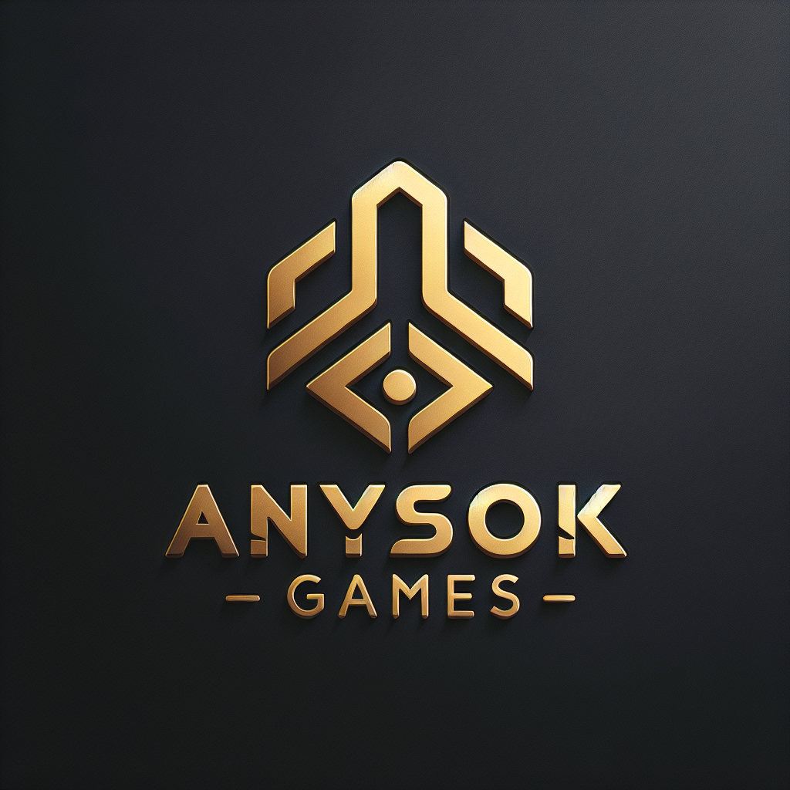
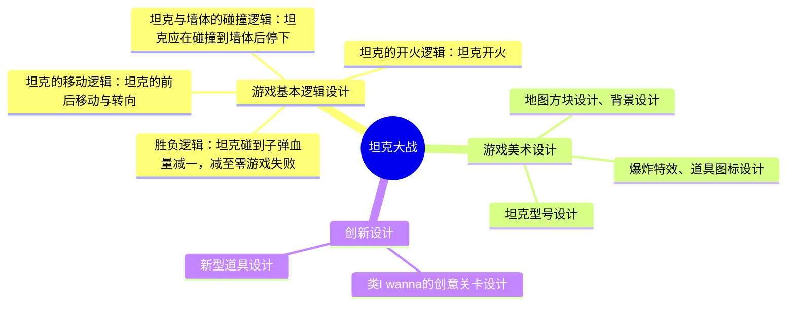
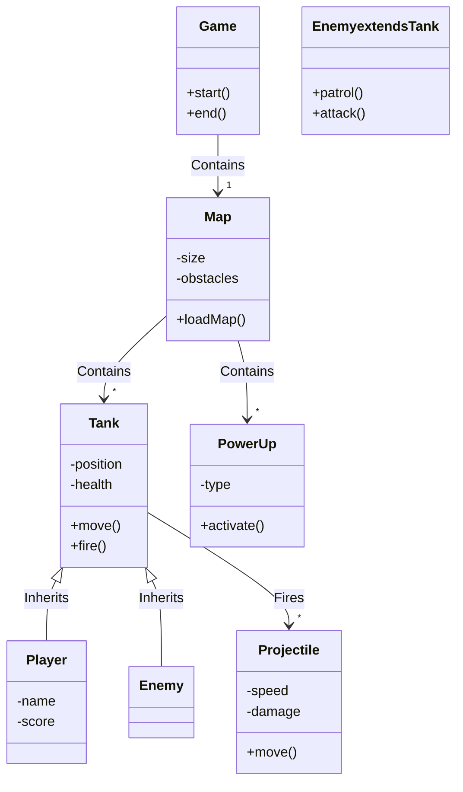
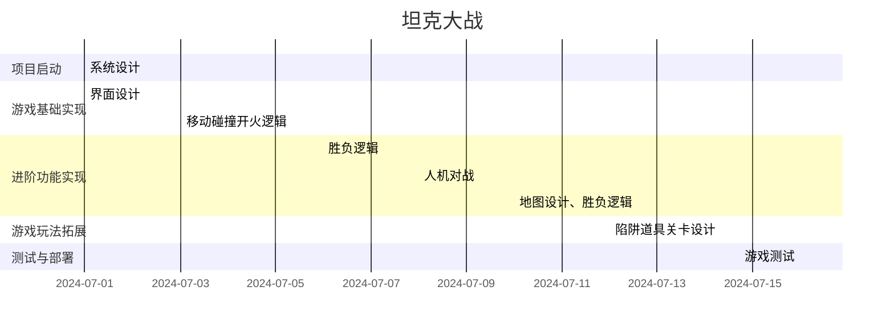
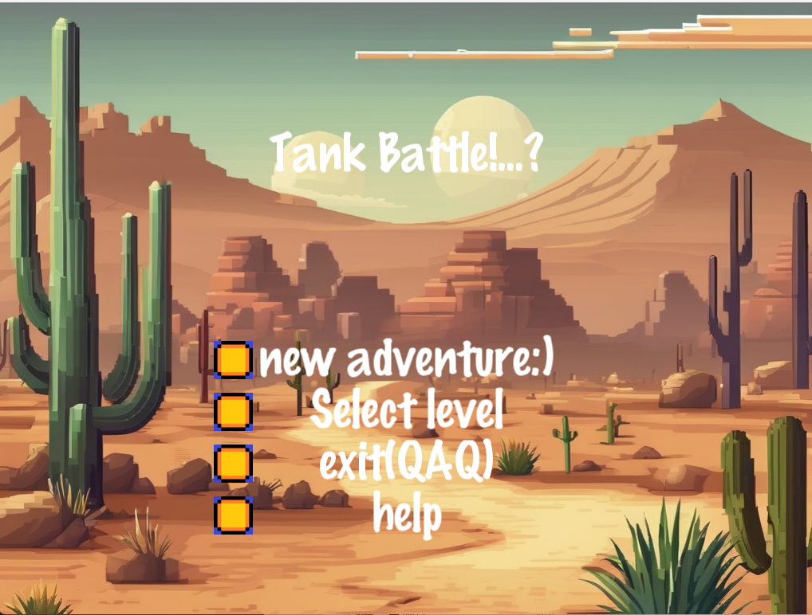
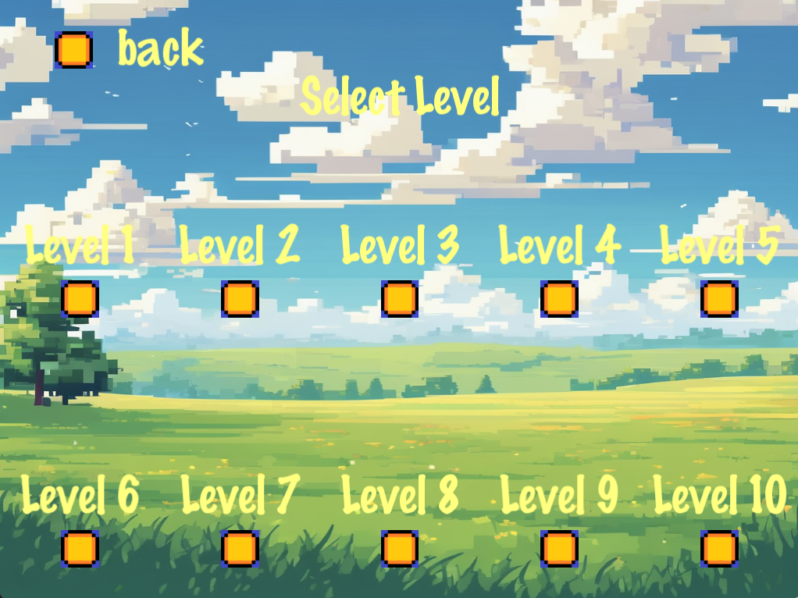
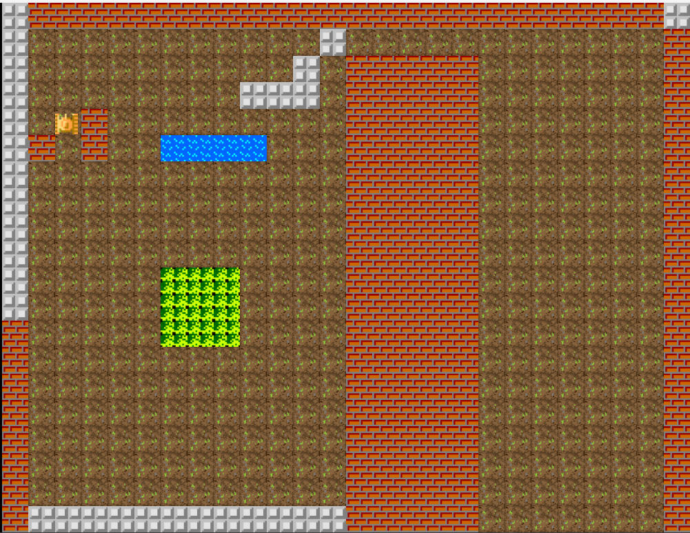
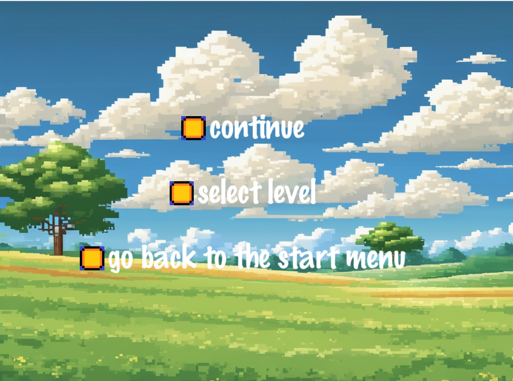

# 坦克大战
## 团队介绍：怎么样都队(ANYSOK)
### 1、团队成员
项目经理：袁悦洋  
开发经理：程昕  
产品经理：高晨希  
团队成员：许岳松、金子豪
### 2、团队logo

  
   
    <em>怎么样都队(ANYSOK)的团队logo</em>

  
## 项目简介
坦克大战是一款经典的坦克游戏。本项目需要在原有坦克大战游戏规则的基础上，加入新的元素，增加新的玩法，改进在手机端的体验，改进美工设计，力图让这款经典游戏历久弥新。 

### 1、项目目标：
- 发一款高质量的坦克大战游戏
- 游戏AI算法实现 
- 引入多种武器，丰富游戏玩法 
- 关卡内容创新
- 实现跨平台支持（PC、移动设备）
### 2、项目内容 
#### 游戏设计 
- 画面风格：经典像素风
- 游戏模式：单人闯关模式、人机对战模式 
- 地图设计：多种战斗场景（城市、沙漠、森林等） 
- 武器系统：多种武器选择（机枪、火箭炮、导弹等） 
- 其他创新内容
#### 技术实现 
- 游戏引擎：coco2dx
- 编程语言：C++
### 3、项目架构图

#### (1). Game（游戏）
- **方法**:
  - `start()`: 开始游戏
  - `end()`: 结束游戏
- **关系**:
  - 包含一个地图（Map）对象。

#### (2) Map（地图）
- **属性**:
  - `size`: 地图的尺寸
  - `obstacles`: 障碍物
- **方法**:
  - `loadMap()`: 加载地图
- **关系**:
  - 包含多个坦克（Tank）和多个增强道具（PowerUp）。

#### (3) Tank（坦克）
- **属性**:
  - `position`: 坦克的位置
  - `health`: 坦克的健康状况
- **方法**:
  - `move()`: 移动
  - `fire()`: 开火
- **关系**:
  - 是玩家（Player）和敌人（Enemy）的基类。
  - 发射多个炮弹（Projectile）。

#### (4) Player（玩家）
- **属性**:
  - `name`: 名字
  - `score`: 得分
- **关系**:
  - 继承自坦克类（Tank）。

#### (5) Enemy（敌人）
- **方法**:
  - `patrol()`: 巡逻
  - `attack()`: 攻击
- **关系**:
  - 也是坦克类（Tank）的一种具体实现。

#### (6) Projectile（炮弹）
- **属性**:
  - `speed`: 速度
  - `damage`: 伤害
- **方法**:
  - `move()`: 移动

#### (7) PowerUp（增强道具）
- **属性**:
  - `type`: 类型
- **方法**:
  - `activate()`: 激活

### 关系细节
- `Game --> '1' Map : Contains` 表示游戏包含一个地图。
- `Map --> '*' Tank : Contains` 表示地图中包含多个坦克。
- `Tank <|-- Player : Inherits` 和 `Tank <|-- Enemy : Inherits` 表示玩家和敌人都是坦克的一种，它们继承自坦克类。
- `Tank --> '*' Projectile : Fires` 表示坦克能发射多个炮弹。
- `Map --> '*' PowerUp : Contains` 表示地图中包含多个增强道具。
### 4、项目阶段 

## 附：游戏截图

  
  
  
  

